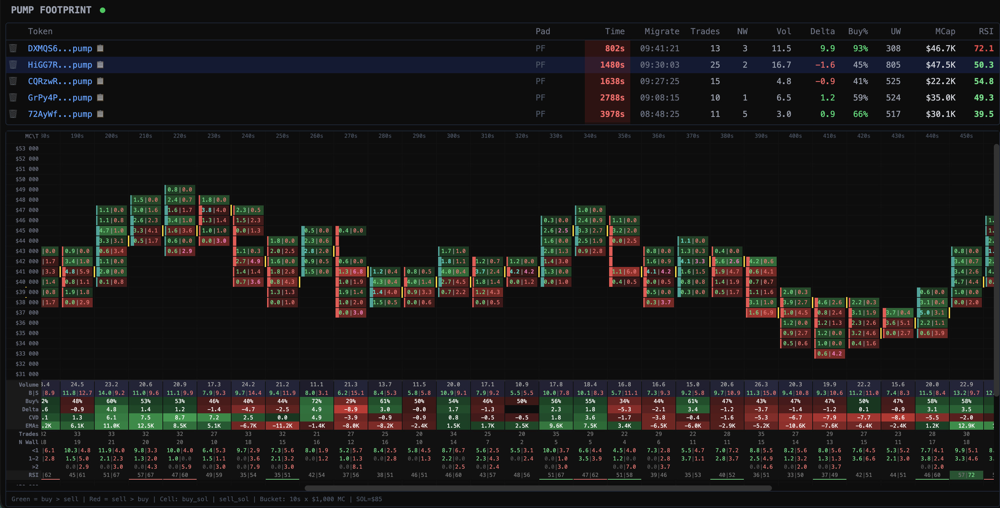

# Pump.fun Footprint



Real-time Pump.fun footprint chart alkalmazás migrált tokenek követésére.

Az alkalmazás egy lokális feeder WebSockethez csatlakozik, a bejövő trade adatokat 1 másodperces és 10 másodperces bucketekbe aggregálja, majd ezeket egy Vue alapú felületen jeleníti meg footprint chartként.

## Fő funkciók

- migrált tokenek automatikus aktiválása és 10 perces követése
- aktív tokenlista market cap, RSI és 10s trade statisztikákkal
- real-time footprint chart 10 másodperces bucketekkel
- bucket szintű trade részletek HTTP API-n keresztül
- lejárt tokenek állapotának mentése az `output/` mappába
- trade-ek mentése külön a `trades/` mappába

## Technológiai stack

- Backend: Python, `aiohttp`, `websockets`, `orjson`
- Frontend: Vue 3, Vite, Tailwind CSS, Chart.js
- Kommunikáció: WebSocket + HTTP API

## Működés röviden

1. A backend csatlakozik a lokális feederhez: `ws://192.168.1.122:9944`
2. A `migrate` event aktivál egy tokent.
3. Az aktív token trade-jei bekerülnek az aggregátorba.
4. Az aggregátor:
   - 1s bucketeket használ RSI számításhoz
   - 10s bucketeket használ footprint chart építéshez
5. A backend WebSocketen tolja a token listát és a footprint frissítéseket a frontendnek.
6. A Python szerver production módban a buildelt frontendet is kiszolgálja.

## Projekt struktúra

```text
pump.footprint/
├── server.py
├── backend/
│   ├── aggregator.py
│   ├── const.py
│   ├── feeder.py
│   ├── footprint.py
│   ├── http_server.py
│   ├── persistence.py
│   ├── token_manager.py
│   ├── trade_storage.py
│   └── ws_server.py
├── frontend/
│   ├── package.json
│   ├── vite.config.js
│   └── src/
├── output/
├── trades/
├── PLAN.md
├── project.md
├── footprint.example.py
└── pumpapi.io_stream_docs.md
```

## Követelmények

- Python 3.11+
- Node.js 18+
- npm

## Telepítés

### Backend függőségek

```bash
python -m venv .venv
source .venv/bin/activate
pip install -r requirements.txt
```

### Frontend függőségek

```bash
cd frontend
npm install
```

## Fejlesztői futtatás

Két folyamat kell:

### 1. Backend indítása

```bash
python server.py
```

Alapértelmezett port: `8080`

### 2. Frontend dev szerver indítása

```bash
cd frontend
npm run dev
```

A Vite proxyzza a következő kéréseket a Python backend felé:

- `/ws`
- `/api`

## Production futtatás

Először buildeld a frontendet:

```bash
cd frontend
npm run build
```

Utána indítsd a Python szervert:

```bash
python server.py
```

Ha a `frontend/dist/` létezik, akkor a backend a statikus frontend fájlokat is kiszolgálja.

Elérés:

- alkalmazás: `http://localhost:8080`
- WebSocket: `ws://localhost:8080/ws`

## HTTPS és értesítések

A böngészős notification funkció miatt a projektet szerveren HTTPS mögött érdemes futtatni. A Notification API megbízhatóan csak secure contextben működik, ezért a gyakorlatban sima HTTP mellett nem használható rendesen.

Jelenlegi szerver oldali felállás:

- a Python alkalmazás fut lokálisan a `localhost:8080` címen
- előtte Caddy reverse proxy fut
- a Caddy ad HTTPS-t és self-signed tanúsítványt
- a böngésző így már engedi a notification kéréseket

Tipikus forgalom:

```text
Browser -> HTTPS / Caddy -> http://localhost:8080
```

Ha WebSocketet is proxyzol, a `/ws` végpontot is tovább kell engedni a Python szerver felé.

Példa Caddyfile:

```caddy
your-domain-or-host {
    tls internal

    reverse_proxy localhost:8080
}
```

Megjegyzés:

- self-signed vagy belső CA tanúsítvány esetén a tanúsítványt a kliens oldalon megbízhatónak kell elfogadni
- lokális fejlesztéshez a Vite dev szerver önmagában nem elég a notification teszteléséhez, ha nincs HTTPS
- production jellegű használathoz célszerű a buildelt frontend + Python backend + Caddy kombináció

## Adatforrás

A projekt nem közvetlenül a publikus PumpAPI streamre csatlakozik, hanem egy lokális feederre:

```text
ws://192.168.1.122:9944
```

Ez azért fontos, mert az upstream oldal egyszerre csak egy kapcsolatot enged. A feeder protokollja a projekt dokumentációja szerint megegyezik a PumpAPI streammel.

Kapcsolódó fájlok:

- `backend/feeder.py`
- `pumpapi.io_stream_docs.md`
- `websocket.example.py`

## Token lifecycle

- a token `migrate` event után válik aktívvá
- az aktív időablak 10 perc
- 60 másodperc után van egy utóellenőrzés market cap alapján
- a lejárt tokenek bent maradhatnak a listában expired állapotban
- a felhasználó manuálisan is törölhet tokent a felületről

## Aggregációs logika

- 1s bucketek: RSI14 számításhoz
- 10s bucketek: footprint chart, OHLC, delta, trade count, POC
- market cap klaszterezés: `1000 USD` szintek
- kezdeti market cap tartomány: `20k - 50k USD`
- SOL/USD konstans: jelenleg `85.0`

Főbb konstansok: `backend/const.py`

## Backend interfészek

### WebSocket

Végpont:

```text
/ws
```

Kliens -> szerver üzenetek:

```json
{ "type": "select_token", "mint": "..." }
{ "type": "unselect_token" }
{ "type": "delete_token", "mint": "..." }
```

Szerver -> kliens üzenetek:

- `token_list`
- `token_added`
- `token_removed`
- `token_summary_update`
- `footprint_snapshot`
- `footprint_update`

### HTTP API

Bucket trade részletek:

```text
GET /api/trades/{mint}/{bucket}
```

Példa:

```text
GET /api/trades/72AyWfN3CWf3Q9h5DorqVmYnkjaAgCZjrTuB73JGpump/12
```

## Frontend felület

A felületen:

- lista jelenik meg az aktív tokenekről
- a mint cím GMGN linkként nyitható
- a mint cím vágólapra másolható
- látszik az aktív idő, launchpad, volumenelemek, delta, buy arány, unique wallet szám, market cap és RSI
- kiválasztás után megjelenik a footprint chart
- a chartból bucket részletmodál is nyitható

## Adatkönyvtárak

### `output/`

Lejárt tokenek mentett snapshotjai JSON formában.

### `trades/`

Tokenenként tárolt trade adatok, amelyeket a bucket részletező API használ.

## Hasznos fájlok

- `project.md`: eredeti projektleírás magyarul
- `PLAN.md`: részletes rendszerterv
- `footprint.example.py`: offline footprint HTML generátor referencia
- `pumpapi.io_stream_docs.md`: stream események és mezők dokumentációja

## Megjegyzések

- A backend alapból a `0.0.0.0:8080` címen indul.
- Ha a frontend nincs buildelve, a backend erről szöveges választ ad.
- A rendszer dirty worktree mellett is használható, mert a futás közbeni adatok külön könyvtárakba kerülnek.
